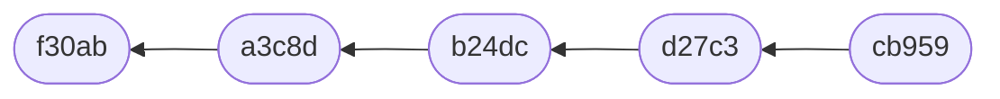

---
# You can also start simply with 'default'
theme: ./theme
# random image from a curated Unsplash collection by Anthony
# like them? see https://unsplash.com/collections/94734566/slidev
background: /images/git-scm-icon.svg
# some information about your slides (markdown enabled)
title: "Webinaire : savoir défaire et refaire avec 'reset'"
info: |
  Découvrez tout le potentiel de cette commande complexe mais fabuleuse !
favicon: /images/favicon.png
# apply unocss classes to the current slide
class: text-center
# https://sli.dev/features/drawing
drawings:
  persist: false
# slide transition: https://sli.dev/guide/animations.html#slide-transitions
transition: slide-left
# enable MDC Syntax: https://sli.dev/features/mdc
mdc: true
# Enable PDF generation
# download: true
---

# Savoir défaire et refaire <br/> avec _reset_

Un webinaire par Techno-low-gic

<a href="https://comprendre-git.com/fr/" target="blank">comprendre-git.com</a>

---
transition: fade-out
layout: image-right
image: /images/photo.webp
---

# Qui suis-je ?

Maxime Bréhin, 14 ans d’expérience avec Git, dont 8 ans en tant que formateur Git, JavaScript, React.

Un parcours professionnel varié : développeur, chef de projet, directeur technique, ingénieur R&D, formateur, entrepreneur.

Créateur de [Technolowgic](https://technolowgic.com/), pour l'accompagnement des entreprises et collectivités à l'éco-conception web et la sobriété numérique.

Militant pour un [numérique acceptable](https://louisderrac.com/numerique-acceptable/) et pour la résilience locale.

---
layout: center
---

# Rappel des concepts utiles

Chaîne de commits, *HEAD* et étiquettes de branches

---

# Git, précurseur de la block-chain ?

L’identité de chaque commit dépend de son ou ses parents.

<GitGraph graph="commits-1" />

---

# Un fléchage à l’inverse de la chronologie

On trouve parfois une représentation fléchée :



---

# HEAD, « vous êtes ici »

Référence notre position actuelle. Détermine d’où part le prochain commit.

<GitGraph graph="commits-2" />

---

# Des étiquettes plus que des vraies "branches"

Ce qu’on appelle "branche" n’est autre qu’**un pointeur** sur un commit en bout de chaîne.

HEAD pointe généralement sur une étiquette de branche. C’est alors cette dernière qui bougera en cas de modification de l’historique.

<GitGraph graph="commits-3" />


---
layout: center
---

# Mille et une façon de "défaire"

---

# Annuler, défaire, corriger

La commande reset est un allié précieux dans de nombreuses situations :

<v-clicks>

1. annuler les X derniers commits, les **retirer de l'historique** (sans garder leurs modifications) ;
2. annuler et **continuer à modifier** ce que contenait le dernier commit ;
3. ajouter un fichier ou des modifications au dernier commit ;
4. défaire et refaire un commit par sujet à partir d’un commit « fourre-tout » (non [atomique](/fr/glossaire/commit-atomique/)) ;
5. revoir un message d’un commit mal rédigé ;
6. regrouper les X derniers commits pour n’en faire qu’un ;
7. repositionner un commit créé sur la mauvaise branche ;
8. annuler un  _rebase_ ;
9. annuler une fusion (_merge_) ;
10. annuler un _pull_.

</v-clicks>

<v-click>

Je m’arrête ici aux scenarios qui touchent de près ou de loin à la commande *reset*. Les cas de figures possibles sont plus nombreux. Par chance, on a [une série d’articles dédiés à chacun d’eux](https://comprendre-git.com/fr/annuler-defaire-corriger/).

</v-click>

---
layout: center
---

# Mais on va péter notre historique si on se trompe 😱 !

Et on va perdre nos commits, notre travail ! Nos collègues vont nous detester, on va se faire virer…

---

# Respire un coup, ça n’arrivera pas…

(enfin j’espère pour toi 😉)

<v-clicks>

Tout ce qui est commité avec Git **existe toujours** malgré l’usage de *reset*. 

La commande ne fait que **déréférencer**. Elle ne détruit pas les objets. 

Ils existent encore dans ton dépôt local mais **n’appartiennent plus à aucun historique nommé**.

La destruction réelle est faite plus tard par le *garbage collector*. 

En gros, tu as un mois pour récupérer ton travail.

Le ***reflog*** est ton ami ! 

```bash
git reflog -10 branche-courante
```

</v-clicks>

--- 

# Masqués mais pas supprimés

Ce qui est perdu peut se retrouver

<GitGraph graph="reset" />


---
layout: center
---

# Maintenant que tu es (un peu) rassuré·e, <br/>entrons dans le vif du sujet !

Pour nous amuser, jouons avec https://learngitbranching.js.org/

---
transition: fade-out
---

# 1. Annuler les X derniers commits, les **retirer de l'historique**

On veut donc **supprimer** un ou plusieurs commits.

Préfère le mode `--keep` au `--hard` qu’on voit partout. Il t’offre une sécurité supplémentaire pour ne pas perdre ton travail non commité.

```bash
# "Suppression" du dernier commit
git reset --keep HEAD~1
# "Suppression" des 3 derniers commits
git reset --keep HEAD~3
```

Evidemment (et ça vaudra pour tout ce qui suit), tu vérifies ton historique après opération, hein !

---

# 2. Annuler et **continuer à modifier** le dernier commit

On change pour le mode le plus doux, le `--soft`. Ça ne fait que bouger nos pointeurs dans l’historique local, sans toucher aux fichiers dans le *working directory* et le *stage*.

```bash
git reset --soft HEAD~1
```

Double vérifications ici : le *log* et le *status* !

---

# 3. Ajouter un fichier ou des modifications au dernier commit

Avec ce qu’on vient de voir, tu peux être tenté·e de faire un `git reset --soft HEAD~1`, d’ajouter tes modifs et de commiter. 

Ça fonctionne à merveille, mais tu as encore plus simple. 

Je triche un peu car *reset* est utilisé implicitement :

```bash
# Ajout de tes modifs et fichiers au stage (git add …), puis :
git commit --amend --no-edit
```

Même vérifs qu’avant : le *log* et le *status* !

---

# 4. Défaire et refaire un commit par sujet à partir d’un commit « fourre-tout »

Idéalement, on vise à produire des commits qui détiennent **des ensembles cohérents de modifications**.

Même procédure que précédemment : on annule en gardant les modifs, et on "découpe" en ajoutant au stage les modifs "triées" avant de commiter. 

```bash
# Le mode juste après "soft" est plus adapté ici :
git reset --mixed HEAD~1
# Vérification 
git status
# Ajout d’un premier lot
git add …
# Premier commit
git commit …
# Et ainsi de suite : git add … + git commit …
```

---

#  5. Revoir un message d’un commit mal rédigé

On peut le faire en 2 temps : 

- annuler le commit en gardant son contenu (mode `--soft`) ;
- recommiter avec un nouveau message.

Mais en vrai, il y a plus simple :

```bash
git commit --amend -m 'Mon nouveau message de commit'
```

**Attention à ce que le *stage* soit vide**, sans quoi ça ajoutera les modifs au commit en plus de changer son message.

---

# 6. Regrouper les X derniers commits pour n’en faire qu’un

Décidemment, le `reset --soft` est bien pratique. 

Il nous sert à défaire les X commits en gardant leurs modifs dans le *stage*. On a alors plus qu’à commiter.

```bash
git reset --soft HEAD~4
git commit -m 'Message des commits groupés'
```

---

# 7. Repositionner un commit créé sur la mauvaise branche

Je ne traite ici que d’une situation particulière : on pensait avoir créé une branche à notre emplacement actuel et on a commité. 

Sauf que la branche n’a pas été créée. On a donc fait "avancer" l’autre étiquette de branche.

On veut alors :

- créer l'étiquette de notre branche à notre emplacement actuel ;
- ramener l’autre étiquette un cran en arrière.

```bash
# On crée l'étiquette à l'emplacement du commmit actuel
git branch feat/zobi
# On ramène la branche actuelle (par exemple "main") un cran en arrière.
# Là j'utilise le mode "soft" pour garder les éventuelles modifs en cours 
# dans le stage et le working directory
git reset --soft HEAD~1
# Je me remets avec mes modifs sur la "bonne" branche
git switch feat/zobi
# Je vérifie mon historique/log
```

---

# 8. Annuler un  _rebase_, un *merge*, un *pull*, un *reset*…

Une commande pour les dominer tous 🦹 !!

La chance qu’on a ici, c’est qu’une seule commande permet de défaire aussi bien une fusion qu’un *rebase* ou un *pull*.

**Attention** : ça ne fonctionne que si on est sur la branche qui vient de bouger ! On vérifie donc avant.

```bash
git reset --keep branche-courante@{1}
```

De manière générale, suite à toute "mauvaise" opération modifiant l’historique, cette commande permettra d’annuler l’opération.

On peut donc même **annuler nos annulations**, nos *reset* grâce à ça !

---
layout: end
---

# Merci

Besoin d'une [formation](https://comprendre-git.com/fr/formation/), d'être accompagné ?
Il suffit de demander !

<a href="mailto:contact@comprendre-git.com">contact@comprendre-git.com</a>

[comprendre-git.com](https://comprendre-git.com)
